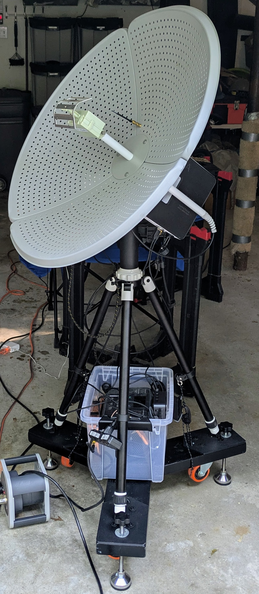

# ASTRA
The Automated Small Telescope for Radio Astronomy (ASTRA) is a low cost platform for astronomy education.

## Description

ASTRA integrates a small radio telescope, an optical wide-field imaging system, a position and orientation sensor, and a GoTo mount. 
An onboard computer enables automation and control of the system. Combined with a browser based interface to student laptops, the 
platform can be used for collection and visualization of radio and optical astronomy data. This enables active learning for science
and radio education through real world measurement.  

The system is relatively inexpensive and suitable for use by a science program or astronomy club. ASTRA can be used as an 
adjunct for lesson plans related to the electromagnetic spectrum, chemistry and physics, and radio and optical astronomy. More advanced
'mini projects' are also possible for small groups of enthusiastic students who are willing to put in more work observing. 

## Key Features

- 70 cm diameter [Discovery Dish](https://www.crowdsupply.com/krakenrf/discovery-dish) radio antenna
- Hydrogen Line (1420 MHz) feed and software radio
- 60mm optical F/4.5 wide field of view optical telescope 
- 8 Mega Pixel CCD (uncooled) for optical imaging
- Goto Telescope Mount 
- Integrated Navigation (GPS), Inertial Measurement (IMU), and Orientation (Magnetometer)
- Battery Operation (12hr+)
- Rolling Base / Cart

### Example Observations

ASTRA can be used to make [radio](docs/observations/radio-obs-example.md) and [optical](docs/observations/optical-obs-example.md) observations. This includes
radio measurement of the hydrogen line, galactic structure and rotation. Optical imaging of the Sun, Moon, star clusters, and major Nebulae also 
enables a direct comparison of radio signatures with wide field of view imaging. 

### System Details

ASTRA can be constructed by a small group using off the shelf components, 3D printed brackets and enclosures, and open source software. 

- [Components](docs/bom/astra-bom.csv)
- [Assembly](docs/hardware/)
- [Software Configuration](docs/system/system.md)
- [Environmental](docs/system/environmental-overview.md)

Although many alternative components exist, the overall selections for ASTRA are a good balance of cost, performance, and integration complexity. 

## Getting Started

## Lessons

Our lessons are currently under development and will be released after we complete testing them. 

### Introduction
- [What is ASTRA?](docs/lessons/astra-intro-overview)
- [ASTRA Setup and Transport](docs/lessons/astra-setup/README.md)
- [Observing Stars with ASTRA](docs/lessons/astra-basic-imaging/README.md)
- [Observing the Sun with ASTRA](docs/lessons/astra-solar-imaging/README.md)
- [Hydrogen Line Detection with ASTRA](docs/lessons/astra-basic-hline/README.md)

### Setup and Calibration
- [How to Align ASTRA](docs/lessons/astra-setup/README.md)
- [How to Focus ASTRA](docs/lessons/astra-intro-focus)
- [Safe Observing with ASTRA](docs/lessons/astra-safety)

### Basic Data Taking
- [Pointing and Tracking](docs/lessons/astra-intro-pointing)
- [Radio Measurement](docs/lessons/astra-radio-measurements)
- [Optical Measurement](docs/lessons/astra-optical-measurements)

### Lesson Plans
- [The Electromagnetic Spectrum](docs/lessons/astra-em-spectrum)
- [The Hydrogen Line at 1420 MHz](docs/lessons/astra-hline-intro)
- [Radio Waves and Propagation](docs/lessons/astra-radio-propagation)
- [Astrochemistry](docs/lessons/astra-astro-chemistry)
- [Outer Space is Not Empty](docs/lessons/astra-space-not-empty)

### Mini Projects
- [Radio and Optical Imaging of the Sun](docs/projects/astra-project-solar)
- [Radio and Optical Imaging of the Moon](docs/projects/astra-project-lunar)
- [Galactic Rotation Curve](docs/projects/astra-project-rotation-curve)
- [Detection of Jupiter](docs/projects/astra-project-jovian)
- [Imaging Andromeda](docs/projects/astra-project-andromeda)
- [The Crab Nebula](docs/projects/astra-project-crab-nebula)
- [Star Cluster Survey](docs/projects/astra-project-star-clusters)
- [Imaging Sagitarius A*](docs/projects/astra-project-sagitariusA)

## License

BSD 3-clause "New" or "Revised" license, see the associated license file. 

## Acknowledgments

ASTRA leverages both the Discovery Dish, GNU Radio, RTL-SDR, Stellarium web, JupyterLab, the Raspberry Pi, Python, and a range of open source libraries
to implement the needed control, user interface, data processing, and hardware systems. These tools are generally installed directly from online repositories. 
