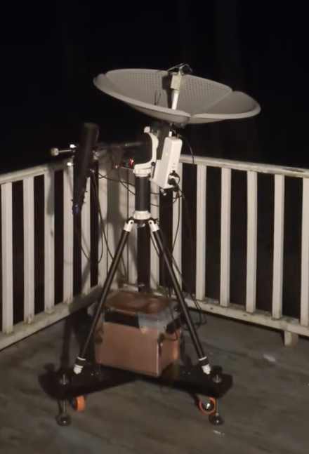

# ASTRA: Automated Small Telescope for Radio Astronomy

## Overview

ASTRA is a mobile radio and optical astronomy teaching cart developed as a smaller, less expensive, and more accessible alternative to the original MIT Haystack Observatory Small Radio Telescope (SRT).

The original SRT was developed at MIT Haystack Observatory in 1998 by Dr. Alan Rogers. While it remains a powerful tool for observing the 1420 MHz hydrogen emission line, it requires a permanent outdoor installation, is relatively costly to build and install, and requires a fair amount of customization due to component availability. 

ASTRA makes different choices to address some of these limitations. In particular, ASTRA provides a moveable, battery-powered, hybrid (radio and optical) telescope using off the shelf components. ASTRA is relatively inexpensive, easily fits through doorways, and can be used directly in classrooms or operated remotely via WiFi by individuals or small teams using a web based interface.

## About
- [ASTRA Components](./about/astra.md)
- [About ASTRA](./about/README.md)
- [License](./about/LICENSE.md)

## System Documentation
- [System Architecture](./system/architecture.md)
- [User Interface](./system/ui-overview.md)
- [Notebook Interface](./system/marimo.md)

## Hardware Documentation
- [Bill of Materials](./hardware/bom/astra-bom.csv)
- [Base / Cart](./hardware/base.md)
- [Mount](./hardware/mount.md)
- [Antenna](./hardware/antenna.md)
- [Feed](./hardware/feed.md)
- [Energy Unit](./hardware/energy_unit.md)
- [Computer](./hardware/computer.md)
- [3D Printed Components](./hardware/3d_prints.md)
- [Antenna Interface](./hardware/astra-ai.md)
- [SDR Carrier](./hardware/sdr-carrier.md)

## Software Documentation
- [Computer Configuration](./system/cpu-config.md)
- [ASTRA Software Overview](./software/overview.md)
- [Software Installation](./software/install.md)
- [ASTRA MQTT API](./software/mqtt-api.md)
- [ASTRA Marimo API](./software/marimo-api.md)

