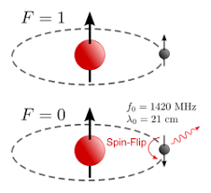
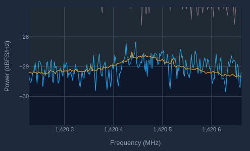
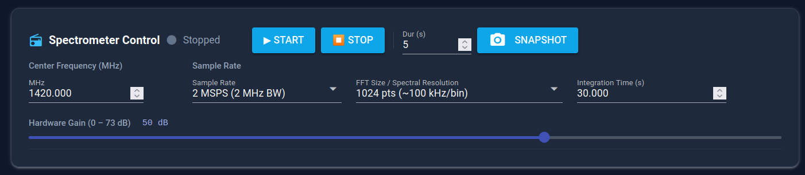
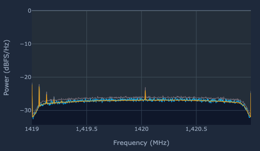
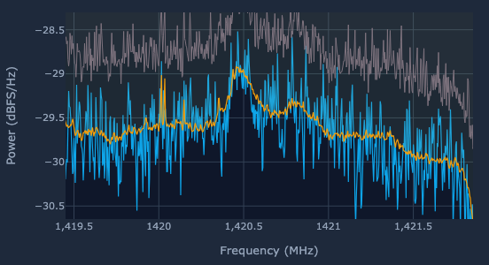

# Simple Radio Observations with ASTRA

## What is the Hydrogen Line?
The hydrogen line is an emission line produced by neutral hydrogen. The electron and proton of the neutral hydrogen have "spin" associated with them, and when the spins are parallel, it is a higher energy level than when the spins are anti-parallel. When the electron flips from a parallel spin to an anti-parallel spin, the energy level of the hydrogen atom is decreased, and as a result, a photon is emitted with a frequency 1420.42 MHz. This photon will then travel through space. If by chance it hits our reflector, it will get directed into the antenna and turned into an electrical impulse. If enough photons hit the antenna, they can integrate out of the noise as a fairly broad band signal.

## Pointing at the Sun
Ensure that either a solar filter or lens cap is on the optical telescope. To prevent the filter from accidentally falling off, it is recommended that the filter is taped to the telescope.

Look up the coordinates of the sun for your location and time in altitude and azimuth. If the azimuth angle is greater than 185 degrees, subtract 360 from the angle and use the resulting angle in, which will be negative. Plug these into their respective fields in the Goto Commands section and press the "GOTO ALTAZ" button.

ASTRA will now slew to point near to the sun. Since the radio telescope has a wider field of view than the optical telescope, the sun should be in the field of view.

## Activate the Radio
Go to the Radio page of the UI. Under the "Spectrometer Control" section press "START". The spectrometer should begin to move. Wait for the hydrogen line to integrate out of the noise. It should appear as a small hump in the orange (integrated) line at around 1,420.4 MHz. To zoom in on the hydrogen line, click and drag to select an area to zoom in on.

If after the integration time the hydrogen line is not visible, try increasing the integration time to 60s.

## Point at Deep Space
Point the telescope out into deep space, away from the sun and galaxy. Now go to the radio page, and you will not see the hydrogen line after the same amount of waiting that you saw the hydrogen line from the sun with.

## Point at the Milky Way
Find an object in the Milky Way, such as Sagitarius A* or Alpha Centauri, or a bright radio star such as Cygnus A or Cassiopeia A. Find the current coordinates of this object in altitude and azimuth. Plug the coordinates into into their respective fields in the Goto Commands section and press the "GOTO ALTAZ" button. Activate the radio. 

