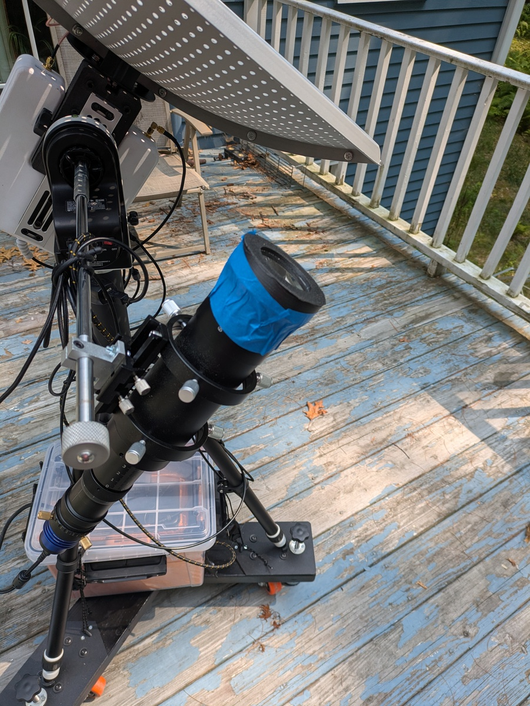
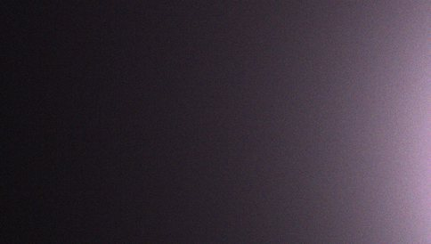
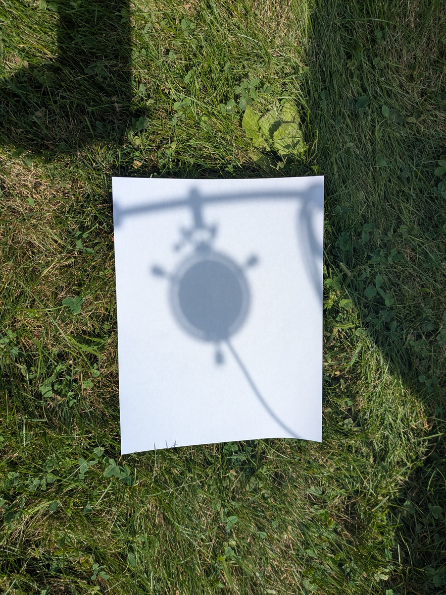
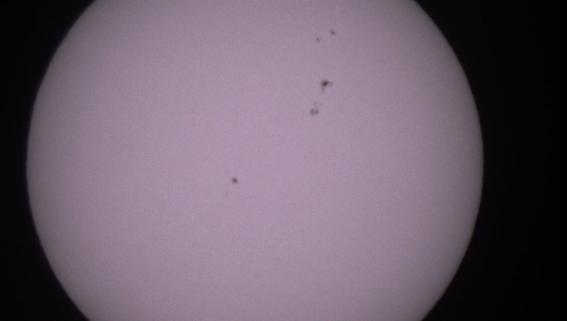

## Safety
While the sun is by far the easiest and brightest object to point at, and also one of the only ones able to be seen during the day, it is also not without risk. Looking at the sun without proper filtering can and will cause eye damage. Pointing a camera at the sun without proper filtering can also harm the camera. Before pointing your ASTRA unit close to the sun, make sure that it has a good solar filter on the optical telescope. This can be attached with painter's tape for easy removal. 

## Leveling ASTRA
Using the spirit level on the tripod and the leveling feet, level the tripod. Check to make sure that the spirit level on the rotator is level. If it is not level, loosen the three set screws on the central pillar, and hold the rotator level while retightening the set screws, making sure to tighten them all the same amounts.

Point the unit to true north, accounting for declination from magnetic north. Level the Antenna Interface.

## Pointing at the Sun
Ensure that a solar filter is on the optical telescope. To prevent the filter from accidentally falling off, it is recommended that the filter is taped to the telescope.

Look up the coordinates of the sun for your location and time in altitude and azimuth. If the azimuth angle is greater than 185 degrees, subtract 360 from the angle and use the resulting angle in, which will be negative. Plug these into their respective fields in the Goto Commands section and press the "GOTO ALTAZ" button.

ASTRA will now slew to point near to the sun. The sun will likely not be in the field of view. To get the sun into the field of view, go to the Camera page of the GUI and press the "CONNECT" button, then the "MOVIE" button, then go to the Control page of the GUI, and move the telescope in small increments in a grid. After each movement check to see if the camera frame has any light in the Camera page of the GUI. Once the frame has light, goose the telescope towards the direction that the light is. Beware that directions may be inverted relative to the image.

To get an idea of the direction to move when the frame does not have light, look at the shadow of the optical telescope. When it is pointing directly at the sun, light will pass between the telescope and its retaining ring, and this is visible in the shadow. You can also try to center the shadow of the antenna of the radio telescope on the dish.

## Focusing on the Sun
Go to the camera page. The camera is likely already active in video mode from pointing at the sun. Using the fine focus only, change the focus a little bit and see if the image looks sharper or less sharp. It is helpful to have one person looking at the computer and another adjusting the focus. For a reference of what the sun looks like, go to https://spaceweather.com and look for "Daily Sun". The camera is able to pick up sunspots well, and sunspots are a good test for how well the camera is focused.
