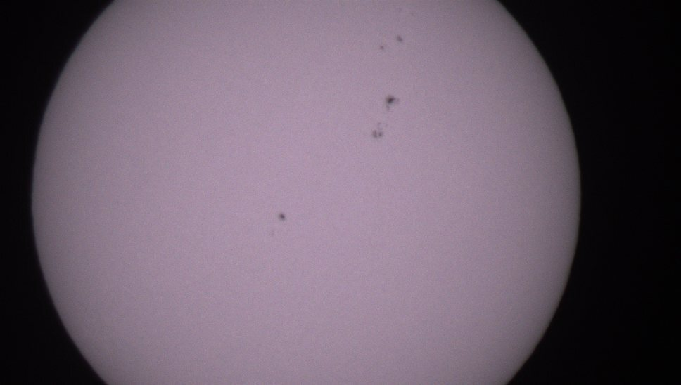

## ASTRA Example Optical Observations

### Solar Images with Sunspots from the UI (live). 

Taken using a 3D printed solar filter using commercial filter film. 

!

### Stellar Images of from the UI (live)

### Post Processed Image Located with Astrometry.net

### Stacked and Integrated Image of Pleides using Siril

