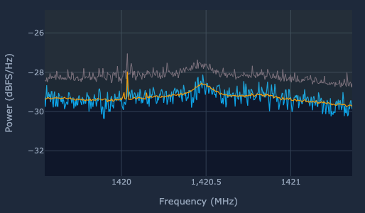
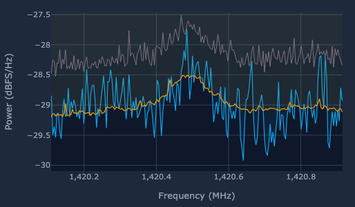
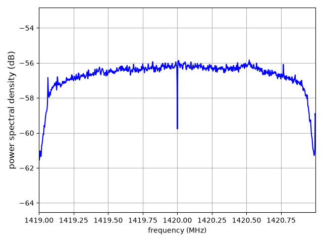
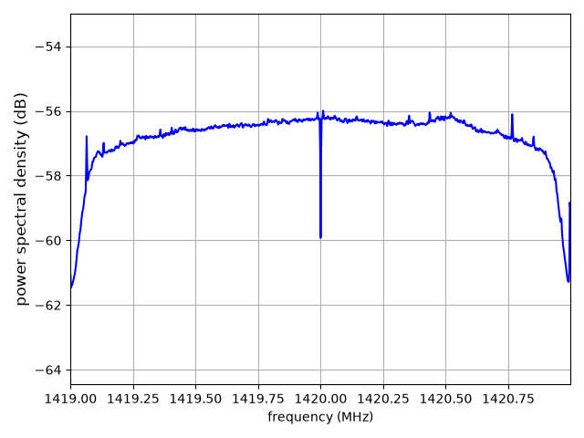
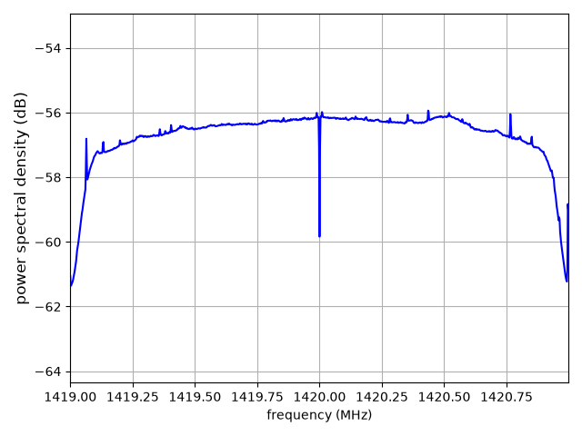
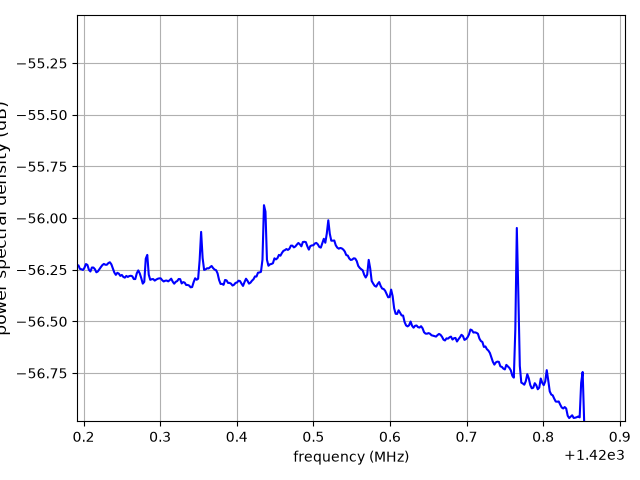

## ASTRA Example Radio Observations

### Background RF

Background data pointed at the horizon with only interference lines visible. 

### Hydrogen Line Detection (Cygnus)

User interface example of live detected 1420.405 MHz Hydrogen Line (21 cm) signal. Pointing was
off of Cygnus. 

and a later time with more zoom and integration...

### DigitalRF Hydrogen Line (Examples)

Example towards polaris recorded as DigitalRF data capture and post processed with 1 second, 10 second, and 100 second integration lengths. A zoom in is shown for the 100 second data. This kind of
processing can be done on ASTRA itself using Marimo notebooks. 

Sharp line like features are generally local or self interference. Shielding and ferrites do help with
this in some cases. Getting away from local RFI is generally most effective. 

### Early Drift Scan

Example of DigitalRF collected and post processed zenith pointing drift scan from early testing. 

