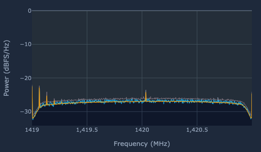

## ASTRA Example Radio Observations

### Background RF

Background data pointed at the horizon with only interference lines visible. 

### Noise Diode RF

Background data with the integrated noise diode activated. 

### Hydrogen Line Detection (Cygnus)

User interface example of live detected 1420.405 MHz Hydrogen Line (21 cm) signal. Pointing was
off of Cygnus. 

### DigitalRF Hydrogen Line (Examples)

M42 Orion example taking as DigitalRF data capture and post processed. 

### Early Drift Scan

Example of DigitalRF collected and post processed zenith pointing drift scan from early testing. 

